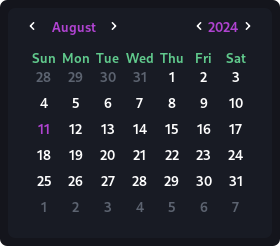
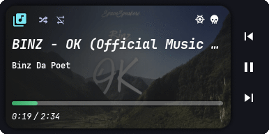

<h1 align="center">🌾 Dotfiles 🍚</h1>
<div align="center">
  
[](https://github.com/k4izokage/dotfiles/stargazers)
&ensp;
[](https://github.com/k4izokage/dotfiles/commits/master)
&ensp;
[](https://github.com/k4izokage/dotfiles/issues)
&ensp;
[](https://github.com/k4izokage/dotfiles/network/members)

</div>

## 🌿 Information

<div align="center">
  
|Feature|Package|
|:---:|:---:|
|Window Manager|[bspwm](https://github.com/baskerville/bspwm)|
|Compositor|[picom](https://archlinux.org/packages/community/x86_64/picom/)|
|App Launcher|[rofi](https://github.com/davatorium/rofi)|
|Context Menu|[jgmenu](https://github.com/jgmenu/jgmenu)|
|Bar|[polybar](https://github.com/polybar/polybar)|
|Widgets|[eww](https://github.com/elkowar/eww)|
|File Manager|[ranger](https://github.com/ranger/ranger)|
|Music/Player|[ncmpcpp](https://archlinux.org/packages/community/x86_64/ncmpcpp/), [spicetify](https://spicetify.app/)|
|Terminal|[alacritty](https://github.com/alacritty/alacritty)|
|Shell|[zsh](https://archlinux.org/packages/extra/x86_64/zsh/)|
|Editor|[neovim](https://github.com/neovim/neovim), [vscode](https://code.visualstudio.com/)| 

</div>

> [!CAUTION]
> - Specific for [Arch](https://archlinux.org/) Linux, and based distros. Ensure that you are fully aware of what you're doing.
> - These dotfiles are still a work in progress. Please open an issue for queries beyond its scope.
> - All the visual config parameters have been written for a [resolution](https://wiki.archlinux.org/title/Xrandr) of 1366x768 pixels.

## ✨ Showcase
<details>
<summary><b> 🚥 Polybar / Eww bar</b></summary>
<br>

|![Shaka][shaka_bar]|![Lilith][lilith_bar]|![Edison][edison_bar]|![Pythagoras][pythagoras_bar]|
|:-:|:-:|:-:|:-:|
|🎨 Shaka|🎨 Lilith|🎨 Edison|🎨 Pythagoras|

|![Atlas][atlas_bar]|![York][york_bar]|![Vegapunk][vegapunk_bar]|![Kaizokage][k4izokage_bar]|
|:-:|:-:|:-:|:-:|
|🎨 Atlas|🎨 York|🎨 Vegapunk|🎨 Kaizokage|

</details>

<details>
<summary><b> 👽 Widgets</b></summary>
<br>
  
<div align="center">
  
|📆 Calendar|🔒 Power menu|🎧 Music player|
|:-:|:-:|:-:|
||||


</div>

</details>

## ⌨️ Keybindings

My configuration is personalized to utilize keyboard shortcuts as well as mouse actions to keep my workflow meaningful and flexible under varying conditions.

## 📥 Installation
<b>Open a terminal in HOME</b>
- **First, download the installer**
```sh
curl https://raw.githubusercontent.com/k4izokage/dotfiles/main/RiceInstaller -o $HOME/RiceInstaller

# Maybe you want a short URL??

curl -L https://is.gd/k4izokage_dotfiles -o $HOME/RiceInstaller
```
- **Give it execute permissions**
```sh
chmod +x RiceInstaller
```
- **Finally, run the installer**
```sh
./RiceInstaller
```

## 📌 Credits
- [gh0stzk](https://github.com/gh0stzk/) - The world of limitless customization with gh0stzk's dotfiles (a unique and exciting experience with 10+ different themes, each featuring captivating color schemes, styles and personality.)


<!-- Links -->
[shaka_bar]: https://raw.githubusercontent.com/k4izokage/dotfiles/refs/heads/main/.github/assets/bar/shaka.webp
[lilith_bar]: https://raw.githubusercontent.com/k4izokage/dotfiles/refs/heads/main/.github/assets/bar/lilith.webp
[edison_bar]: https://raw.githubusercontent.com/k4izokage/dotfiles/refs/heads/main/.github/assets/bar/edison.webp
[pythagoras_bar]: https://raw.githubusercontent.com/k4izokage/dotfiles/refs/heads/main/.github/assets/bar/pythagoras.webp
[atlas_bar]: https://raw.githubusercontent.com/k4izokage/dotfiles/refs/heads/main/.github/assets/bar/atlas.webp
[york_bar]: https://raw.githubusercontent.com/k4izokage/dotfiles/refs/heads/main/.github/assets/bar/york.webp
[vegapunk_bar]: https://raw.githubusercontent.com/k4izokage/dotfiles/refs/heads/main/.github/assets/bar/vegapunk.webp
[k4izokage_bar]: https://raw.githubusercontent.com/k4izokage/dotfiles/refs/heads/main/.github/assets/bar/k4izokage.webp
